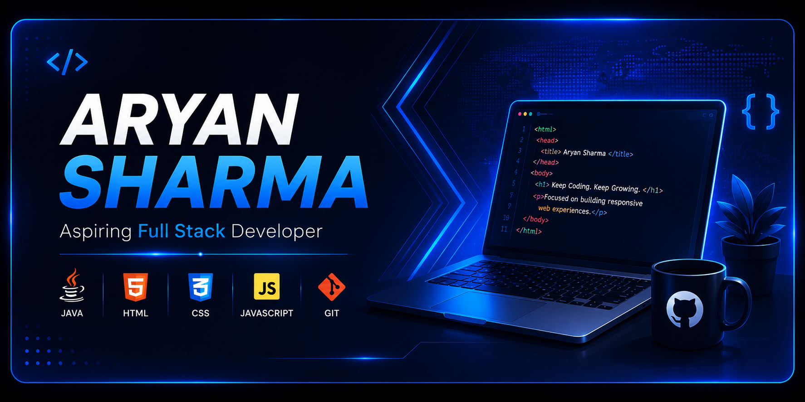

  

# 👋 Hi, I'm Aryan Sharma

  

  

## 💫 About Me

- 🎓 **B.Tech CSE Student (2nd Year)**
- 💻 **Aspiring Full Stack Developer**
- 🌱 Learning **Java, Data Structures & Algorithms, Web Development**
- 🚀 Building real-world projects and improving every day
- 💼 Open to internship opportunities and collaboration
- 📍 Sonipat, Haryana, India

---

## 🌐 Connect With Me

---

## 🛠️ Tech Stack

### Languages

### Tools

---

## 💼 Experience

| Role | Organization |
|------|--------------|
| 🌐 Web Development Intern | InternPe |
| 💻 Frontend Developer Intern | DecodeLabs |

---

## 🚀 Featured Projects

### 🚗 Swift RS
- 🔗 Live: https://swiftrs.netlify.app/
- 💻 Repository: https://github.com/dev-aryansharma/Task-1-Aryan

### 🛒 NeonTech Store
- 🔗 Live: https://neontech-store.netlify.app/
- 💻 Repository: https://github.com/dev-aryansharma/neontech_ecommerce.website

---

## 📊 GitHub Stats

---

## 🏆 GitHub Trophies

---

## 📈 GitHub Activity Graph

---

## 🎯 2026 Goals

- ✅ Master Java
- ✅ Strengthen DSA
- 🔄 Learn React
- 🔄 Learn Node.js & Express
- 🔄 Learn MongoDB
- 🚀 Build 20+ Projects
- 💼 Secure a Software Development Internship

---

## 💬 Quote

> **"Consistency beats intensity. Build. Learn. Improve."**

---

⭐ Thanks for visiting my profile!
